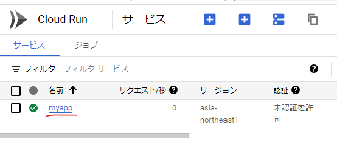

## はじめに
本ディレクトリはフロントエンドソースコードを格納するディレクトリです．

## 環境構築
|        |           |
| ------ | --------- |
| python | 3.11      |
| pipenv | 2023.5.19 |

※その他のライブラリはPipfile参照

wsl2で環境構築を行う場合は，
以下の記事を参考にしてください．\
環境構築：<https://qiita.com/My-Tech/private/4c90a04eb8684d9da4b9>\
pipenvの使い方：<https://qiita.com/y-tsutsu/items/54c10e0b2c6b565c887a>

### 実行コマンド(Pipfileが無い場合)
```
pipenv --python 3.11
pipenv install --dev black flake8 pyproject-flake8 isort[pyproject] mypy
pipenv install python-dotenv openai fastapi 'uvicorn[standard]'
```

### 実行コマンド(Pipfileが有る場合)
```
pipenv install
```

Pipfile.lockがあり，PipfileでなくPipfile.lockから詳細なバージョンなども合わせて環境を作成したい場合は以下のコマンドを実行する．
```
pipenv sync
```

### アプリの実行

```
cd backend
pipenv run uvicorn src.server:app --reload
```

## アプリのデプロイ方法
### gcloudの登録
gcloudのインストールは下記を参考にしてください．\
<https://zenn.dev/pino0701/articles/gcloud_install>

Webブラウザからgcloudにログインし，新しいプロジェクトを作成する．\
新しいプロジェクト作成後，ProjectIDをメモする．

### Dockerコンテナ化
まず，requirements.txtをpipenvで作成します．
```
pipenv requirements > requirements.txt
```
プロジェクトディレクトリ内で、以下のコマンドを実行してDockerイメージをビルドする．
```
docker build -t [APP_NAME] .
```
Google Cloudアカウントでログインし、プロジェクトを選択する．\
また，gcloudでDockerが使えるよう認証を行う．
```
gcloud auth login
gcloud auth configure-docker
gcloud config set project [PROJECT_ID]
```
作成したDockerイメージをGCRにアップロードする．
```
docker tag [APP_NAME] gcr.io/[PROJECT_ID]/[APP_NAME]
docker push gcr.io/[PROJECT_ID]/[APP_NAME]
```
アップロード完了後にWebブラウザでgoogle cloudにアクセスし，\
以下の記事を参考にCloudRunの構築を行う．\
<https://zenn.dev/kthrlab_blog/articles/c410050147c8c1?redirected=1#cloud-run%E3%81%AE%E6%A7%8B%E7%AF%89>

### PROJECT_ID


### APP_NAME


## 環境変数

## 備忘録
* docker build . -t appを実行後にERROR: Cannot connect to the Docker daemon at unix:///var/run/docker.sock. Is the docker daemon running?が出る
  * sudo service docker startを実行し，dockerを起動する
* docker push ~実行時に以下のエラーが表示される．
  * gcloud auth configure-dockerを実行する．
```
unauthorized: You don't have the needed permissions to perform this operation, and you may have invalid credentials. To authenticate your request, follow the steps in: https://cloud.google.com/container-registry/docs/advanced-authentication
```
