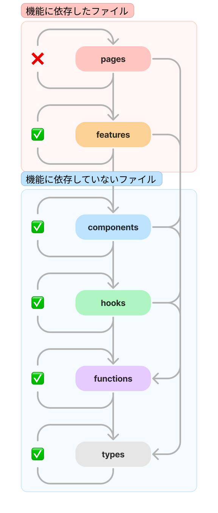

## はじめに
本ディレクトリはフロントエンドソースコードを格納するディレクトリです．

## 環境構築
|              |      |
| ------------ | ---- |
| React        | 18.2 |
| TypeScript   | 4.9  |
| mui/material | 5.14 |

※その他のライブラリはpackage.json参照

### 実行コマンド
```
cd frontend
npm install
npm install firebase
npm install npm install @mui/material @emotion/react @emotion/styled
```

## アプリのデプロイ方法
```
firebase login
npm run build
firebase deploy
```

参考：<https://yoheiko.com/blog/post-769/>

## ディレクトリ構成
src/\
├─ pages/ # URLに対応するComponent\
├─ features/ # 機能に依存するComponentやHook\
├─ components/ # 機能に依存しないComponent(共通Components)\
├─ hooks/ # 機能に依存しないHook(共通Hook)\
├─ functions/ # 機能に依存しない関数(共通関数)\
├─ types/ # 機能に依存しない型定義(共通type)\
├─ configs/ # 外部ライブラリの設定(firestore.jsonなど)\
├─ index.tsx # ルーティング設定

### 依存関係
configsを除く6つのディレクトリの依存関係は以下\
各ディレクトリは左図のように上から下に依存する。\
〇pagesがfeaturesやcomponentsに依存\
×componentsがfeaturesに依存\


## 環境変数
環境変数は.env.localに以下の変数を格納する．\
※空文字が格納されている変数は各自の環境に合わせて設定する．\
```
REACT_APP_BACKEND_SERVER_URL=""
REACT_APP_APIKEY=""
REACT_APP_AUTHDOMAIN=""
REACT_APP_DATABASEURL=""
REACT_APP_PROJECT_ID=""
REACT_APP_STORAGE_BUCKET=""
REACT_APP_MESSAGING_SENDER_ID=""
REACT_APP_APP_ID=""
REACT_APP_MEASUREMENT_ID=""
REACT_APP_MAIL_URL=""
```